All reviewed local source continuations are integrated, and only the primary working directory remains registered. The [closeout report](docs/integration/closeout-20261006.md) records passing hosted workflows, verified backup consolidation, and two retained directory remnants. [Issue 60](https://github.com/Ding-Ding-Projects/BambuStudio/issues/60) tracks unfinished native and website acceptance; source integration is not product acceptance.

> [!IMPORTANT]
> Current status, 6 October 2026: the exact-main root build at `cc059003d` passed at 16:43:57 UTC and the exact installer entrypoint is running. Reviewed redesign preparation from `1fa14f33a` is now merged into main; its 71 offline checks do not prove rendering, and the merged tree has no native build result yet. Separately, both exact root build entrypoints and independent installer-byte verification passed for the earlier redesign candidate `a28944e3c14b2066ee63d14151c8aca23066d743`. Two authorized visible attempts exited before inspection, so there is no current screenshot or complete visual acceptance. Read the [current continuation](CLOSEOUT_PROMPT.md).

# BambuStudio

MCP and command-line automation is being implemented for live projects, headless
slicing, and configured printers. See [setup and verification status](docs/features/automation/mcp-and-cli.md).

The current interface work also includes [local personal wording](docs/features/windows/personal-vocabulary.md),
[separate slicing actions](docs/features/windows/print-actions.md), and
[searchable canvas menus](docs/features/canvas-menu-search.md). These changes are
under development for the combined delivery; the [audit register](docs/features/design-system/native-interface-audit-2026-10-02.md)
records historical runtime and layout evidence. Focused source and non-window geometry checks now cover the current redesign; they do not establish native runtime or screenshots.
Implementation is not a claim of verified physical-printer behavior.
Current compiler and startup evidence is summarized in the [continuation record](CLOSEOUT_PROMPT.md).
The earlier configure blockers are superseded. Current build and package evidence is recorded against exact source revisions in the verification report. The earlier production catalogue, documentation bundling and DeviceWeb observations belong to their dated source receipts. Reviewed inspection preparation covers all 55 declared states; 38 preparation checks and 33 native-review checks pass offline. The initial startup cause remains unknown, and a reviewed target-exit diagnostic prepares the next attempt. Exact-main packaging remains pending. The inherited DeviceWeb type stage attempted once and failed before bundling during the older delivery pass; no passing type-check result is claimed.
Earlier managed-check results apply only to their recorded source revisions. The combined source includes the reconciled continuation lanes and bounded repairs listed in the current handoff.

Bambu Studio is a cutting-edge, feature-rich slicing software.  
It contains project-based workflows, systematically optimized slicing algorithms, and an easy-to-use graphic interface, bringing users an incredibly smooth printing experience.

This fork's maintained delivery target is native Windows UI modernization informed by Material Design 3. The
[latest Windows installer](https://github.com/Ding-Ding-Projects/BambuStudio/releases/latest/download/Setup.exe)
is a per-user install and does not require administrator elevation. It is currently unsigned; verify
the accompanying
[SHA-256 file](https://github.com/Ding-Ding-Projects/BambuStudio/releases/latest/download/Setup.exe.sha256)
before running it. **This fork is Windows-only.** macOS and Linux support has been removed from the tree: the
platform sources, build scripts, packaging and CI jobs are gone, and CMake fails fast when
configured on any other system. Cross-platform builds remain available upstream from
[Bambu Lab](https://github.com/bambulab/BambuStudio/releases/).

## Current development work

The [Studio Atlas design](design/workflow-refresh.md) covers the whole native application and product-owned embedded views, retaining existing features and action semantics. It includes Prepare, Preview, Print, Monitor, settings, fields, dialogs and nested tools. Source implementation and independent review are ongoing; a shared palette alone does not complete a surface.

**The design can be reverted if the maintainer dislikes it.** Review the [change ledger](design/workflow-refresh/change-ledger.json) and reverse only the appropriate appearance changes, preserving build, printer, AMS, slicing and data fixes. Mixed functional/presentation commits require selective review; resetting to the old baseline is not the reversal procedure.

The previously preserved responsive-workflow and local-history source has been reconciled into the combined delivery revision. This pass adds bounded draft/history, continuity, import and automation repairs. Release delivery remains pending; see [the current continuation record](CLOSEOUT_PROMPT.md). Import cancellation remains cooperative and cannot interrupt an indivisible reader, hull calculation, object copy or final scene update. Issue #16's separately licensed companion remains a separate decision and is not included in this delivery.

The source branch for the next Windows release reconciles upstream Bambu Studio
2.8.4.57, with the fixes of upstream 2.8.4.61 merged on 2026-09-29, with this fork's native UI. It adds remembered dual-nozzle grouping,
quick swaps and a Slice and print setup action, LAN printer farm routing,
camera autoplay and fan feedback, a native Model Creator, portable multi-file
workspaces with checklists and planning, and history embedded in saved 3MF
files. The current combined source is undergoing local build and packaging; runtime and
printer verification are not performed in this pass. The latest published installer link above remains the
last verified release until a newer release is confirmed. See the
[roadmap](ROADMAP.md) and [handoff](HANDOFF.md) for exact state and limitations.

The Windows UI provides three canonical fork modes: English (`en`), playful Hong Kong Cantonese
preview (`yue_HK`), and English + Cantonese (`bilingual_en_yue_HK`). Existing Bambu Studio locales remain
available. The Cantonese catalog covers every message the app extracts, with any gap falling back to
English, and bilingual mode pairs both languages on every native surface where they fit. The Cantonese
is agent-drafted and still awaits broader human review. See the
[language-mode documentation](docs/features/windows/language-modes.md) for coverage and fallback
details.

### New features in this line

Features added for this line of releases, with where each one stands. "Verified" means checked in an
unmodified release package on a hidden desktop; the evidence is listed in
[the capture provenance](docs/screenshots/md3-everything/README.md).

| Feature | Status | Details |
| --- | --- | --- |
| Automatic updates from this fork's GitHub releases: an installed copy downloads a new version in the background, then a banner offers **Restart to install update** and **Release notes** and says the update is not code-signed; it checks again every six hours, and the download dialog stays as the fallback | In releases since `md3-v151`; the **Update automatically** preference is verified in all three language modes; an installed copy updating itself is not verified yet | [App updates](docs/features/windows/app-updates.md) |
| The release feed moves: a build becomes the latest release when its commit is newer than the current latest | Verified (`md3-v151` onward) | [Release supply chain](docs/features/releases/windows-release-supply-chain.md) |
| Every update package carries a higher version than the latest release before it: hosted builds number packages by workflow run, because two queued builds could share a number (`md3-v155` and `md3-v156` both `2.8.4155`) and Squirrel skips an equal version | Verified: `md3-v161` `2.8.4608`, then `md3-v162` `2.8.4611` | [App updates](docs/features/windows/app-updates.md) |
| Faster hosted Windows builds: each build restores the last `main` build tree from a never-published draft release, stored in parts of at most 1.5 GB, and compiles only what changed (the full compile took 72 of the build's 80 minutes) | Measured: the first warm build compiled in 3 min 4 s (10 compile requests instead of 795) and its build job took 12 min 44 s instead of 80 min 16 s | [Build cache](docs/features/releases/windows-release-supply-chain.md#build-cache) |
| Preview overlays keep clear of each other: notifications end left of the legend dock, the status chip starts right of the plate strip, the dock's blocks span it, and the Ink Grouping card is sized from its content | In source (`856d92a2c`); compiled by run [36747308882](https://github.com/Ding-Ding-Projects/BambuStudio/actions/runs/36747308882) and published as `md3-v177` (package `2.8.4635`); captures from a release are pending | [Preview overlays](docs/features/gcode-preview/preview-overlays.md) |
| Ink wording everywhere: the English catalogue carries the ink wording for 94 messages that relied on a runtime word swap ("a ink" is now "an ink"), 19 Cantonese values are corrected, the dispenser names built from tables and the other text that skipped the catalogue go through it, and a check starts from every message the application can show | In source (`4ef3a9394`, `3bb44bc5d`); the catalogue half is in `md3-v177` | [Ink terminology](docs/features/windows/ink-terminology.md) |
| One shortcut, named Bambu Studio MD3, that starts the application: the launcher is marked aware of the installer and makes its own shortcuts, so the regex helper no longer gets one | In source ([issue #52](https://github.com/Ding-Ding-Projects/BambuStudio/issues/52)); the release job reads the shortcuts back after installing | [App updates](docs/features/windows/app-updates.md#shortcuts-and-install-events) |
| The splash screen says when the running version was released, in English, Cantonese or both | Verified on `md3-v153` | [Splash release date](docs/features/windows/splash-release-date.md) |
| Bilingual mode on every native surface: labels, buttons, check boxes, radio buttons, group boxes, section headers, list and table column titles, placeholder hints, tooltips, menus, message dialog bodies, notification links, self-drawn widgets and the 3D canvas, each paired only where both languages fit, with the Cantonese in the tooltip otherwise | Verified surface by surface; the `md3-v153` language audit found no English-only label on Prepare or Preferences > General | [Language modes](docs/features/windows/language-modes.md) |
| A complete Hong Kong Cantonese catalog (7,660 entries), Cantonese feature articles (77) and a Cantonese in-app changelog | In releases; human review pending | [Language modes](docs/features/windows/language-modes.md) |
| Cantonese line breaking that never starts a line with closing punctuation such as "。" and never splits an emoji | Verified on `md3-v157` for closing punctuation; opening punctuation and emoji by contract test only | [Language modes](docs/features/windows/language-modes.md) |
| Every dialog kept inside its own edges in all three modes: 37 clipping defects found by capture and by the layout probe, each with its cause and fix | 25 verified in built packages (CJ-005 to CJ-029), 12 fixed in source and waiting for a capture (CJ-001 to CJ-004, CJ-030 to CJ-037), none open | [Clipping inventory](docs/features/design-system/clipping-inventory.md) |
| Every context menu is the Material menu: the text fields' edit menu from a right-click and from the Menu key or Shift+F10 (a masked field never copies), copyable labels, the caption bar's menus and the canvas and list menus; web pages show no browser menu | Verified on `md3-v169`: 8 of 8 menu requests per mode opened the Material menu, in English, Cantonese and bilingual; on `md3-v162` text fields opened nothing on a right-click and the system's English edit menu from the keyboard | [Context menus](docs/features/design-system/context-menus.md) |
| The last native-looking fields on the kit: the appearance editor's decimal fields, the colour picker's HEX and any-format fields, the object list's rename editor and the What's new year field; no native spin control is left | In source, not yet in a release | [Appearance editor](docs/features/windows/appearance-editor.md) |
| Every group box draws the Material outline and title, the bed shape dialog chooses its shape with the kit combo, and no dialog keeps a native OK or Cancel button | In source, not yet in a release | [Native controls on the kit](docs/features/design-system/native-controls.md) |
| The last native controls on people's screens are kit controls: a disabled button's tip, the web pages' notice bar, and the Workspace panel's tabs, tables, checklist and calendar; every table takes one Material style | In source, not yet in a release | [Native controls on the kit](docs/features/design-system/native-controls.md) |
| Every scrolled page, panel, list, table, multi-line text box and HTML view shows the Material scrollbar: a 10 px strip with a rounded thumb that highlights under the pointer, in place of the 17 px grey Windows bar; it drags, pages while held and follows high contrast | In source, not yet in a release | [Native controls on the kit](docs/features/design-system/native-controls.md) |
| Every prompt, chooser, busy notice and colour picker is a Material dialog, and ink colours keep the recently used colours as quick picks | In source, not yet in a release | [Dialogs and pickers](docs/features/design-system/dialogs-and-pickers.md) |
| Every tooltip is the Material plain tooltip, in the light and the dark theme | In source, not yet in a release | [Tooltips](docs/features/design-system/tooltips.md) |
| Every message box is the Material dialog, in the theme and the language modes, except the few that fire before the app's own interface exists | In source, not yet in a release | [MD3 parity register](docs/features/design-system/md3-parity-register.md) |
| Units and separators shown as themselves: "°C", "mm³" and the What's new separators used to read "°C" and "·" because narrow literals went through the Windows code page | Verified on `md3-v158` | [Handoff](HANDOFF.md) |
| Verification tools: the layout probe's `language-audit` command and splash hook, and capture scripts for dialogs, the splash, Preferences search and the language audit | In use for every release check above | [Layout probe](docs/features/design-system/layout-probe.md) |

Still to add or verify for these features: an installed copy updating itself from one release to the
next (it needs a Windows account whose installed copy can be replaced), notification links captured
in a release, the 125%, 150% and 200% display scales, and human review of the Cantonese.

## Native UI modernization (Material Design 3)

The production wxWidgets application now consumes the vendored Material Design 3 design system
end-to-end. The canonical in-repo design source is [`ui-md3/design-system/`](ui-md3/design-system/);
its token values match `src/slic3r/GUI/Widgets/MD3Tokens.hpp` exactly, and the native code resolves
colors through semantic tokens instead of hardcoded hexes. A ground-up migration converted theme
colors and fonts across essentially the whole GUI tree (roughly 120 files over six waves), backed by
Roboto and Roboto Mono shipped as application resources. Contextual schemes are resolved per
workspace: brand green for Prepare and general UI, Preview purple for the G-code preview, and Device
teal for the printer surfaces. Functional data colors (ink swatches, G-code feature colors, 3D
paint palettes) are deliberately preserved.

Beyond the token layer, an element-by-element conformance register
([`docs/features/design-system/md3-parity-register.md`](docs/features/design-system/md3-parity-register.md))
drove nine implementation waves of structural component anatomy. As of 2026-07-22 the register
stands at **120 rows done, 4 recorded deviations** (each documented with concrete evidence in the
register), **and 5 open rows** — the deep Prepare-sidebar rebuilds (printer identity card, bed
field, ink info-rows, Process card, Objects card) — which are being finished in a concurrent
implementation wave. Landed anatomy includes the Material Symbols icon font and ImGui glyph atlas,
the rebuilt shared widget kit, the `MD3Dialog` shell with the MessageDialog family and the
raw-`wxMessageBox` sweep, the kit title bar, the Preferences NavRail with runtime density/accent
controls, the device camera HUD and card grid, the Preview timeline transport bar, and the
glyph-to-GL-texture bridge for the 3D toolbar and gizmo rail. The register itself is the live
tracker; counts above are as of this writing.

Two native features were added in the same effort:

- A native OpenGL model preview for the MakerWorld "Download and Open" flow shows an interactive
  orbit/zoom/fit view before import, with **Open in Prepare** and **Close** actions and a
  failure-safe fallback to the normal import. See
  [MakerWorld OpenGL preview](docs/features/model-preview/makerworld-opengl-preview.md).
- A dockable Prepare sidebar can be docked left, right, top, or bottom (default left) and re-docks
  live from a Preferences control. See
  [Dockable Prepare sidebar](docs/features/prepare/dockable-sidebar.md).
- Every record the app owns is exportable through one shared Export dialog: version history,
  preferences, presets, the object list and print statistics, in JSON, JSON Lines, YAML, TOML, XML,
  CSV, TSV, Markdown or HTML with lossless/lossy badges and the exact loss reasons, UTF-8 with an
  LF/CRLF choice and a schema header, optionally wrapped in ZIP or a fully configurable 7z. See
  [Export everything, in every format](docs/features/workspace/export-everything.md).

Full documentation of the token layer, migration, failure modes, and audit result is in
[Vendored Material Design 3 design system](docs/features/design-system/md3-design-system.md).
The native split actions, option menus, segmented selectors, links, tabs, Ink Dispenser controls,
Filament Manager, Project page, and setup guides now share a documented keyboard, assistive, zoom,
and responsive-layout baseline; see
[Keyboard, assistive, and responsive GUI accessibility](docs/features/windows/gui-accessibility.md).

### Live application captures

These are captures of the running native application, launched on a hidden desktop and captured
window by window with `PrintWindow`. They come from more than one capture run, and some file names
keep a date or commit that no longer describes their pixels. The
[screenshot provenance](#screenshot-provenance) table gives the real source of every image.

- **New on 2026-10-09.** Eight images were retaken from the published release
  [`md3-v231`](https://github.com/Ding-Ding-Projects/BambuStudio/releases/tag/md3-v231) (package
  `2.8.4835`, source commit
  [`31410274b6fda69ff51b01a7a978704e8908a884`](https://github.com/Ding-Ding-Projects/BambuStudio/commit/31410274b6fda69ff51b01a7a978704e8908a884))
  by the dispatch-only [README screenshot workflow](docs/features/automation/readme-screenshots.md),
  target `native-app`, in
  [run 37875388464](https://github.com/Ding-Ding-Projects/BambuStudio/actions/runs/37875388464).
  The run installed the release on a hosted Windows runner, verified the installation, and captured
  the installed application at a 1920x1080 display with the package's Mesa llvmpipe software
  OpenGL renderer, so the 3D plate is drawn. The data folder was a fresh English, light,
  comfortable profile with no model loaded, so the plate is empty and nothing is sliced. Every
  image passed the workflow's fail-closed privacy check, and the maintainer reviewed each one
  before it was committed.
- **Earlier captures.** Every other native image in this README was not replaced by that run and is
  still the earlier file. The `md3-v231` retakes of the Home page and the Ink page were rejected
  because their embedded web pages rendered blank on the runner; the privacy check withheld the
  Setup Wizard retakes because the captured files fell outside its size bounds (reason
  `image-bytes`); the remaining rows' capture steps were not done (reason `not-done`); and the two
  process-sidebar "before" images are historical evidence of a fixed defect and are never retaken.
  Most of these earlier images were last written on 2026-09-06 by `scripts/md3/recapture.py`
  passes on builds of `main` at `2cf53a936`, `84f6bc5c9` or `2dcc26658`; where they include the 3D
  canvas, it is blank. A few of them do not show what their file name says, and their captions
  below say what they do show.

**Main surface and Setup Wizard**

These file names come from a 2026-08-11 capture of source commit `ca49ec7d`, but neither image is
from that capture any more: the main surface is new from `md3-v231`, and the Setup Wizard welcome
page is the earlier 2026-09-06 capture from build attempt 20 of `main` at `84f6bc5c9`.

| Native main surface (`md3-v231`) | Setup Wizard welcome page (earlier capture, 2026-09-06) |
| :---: | :---: |
| 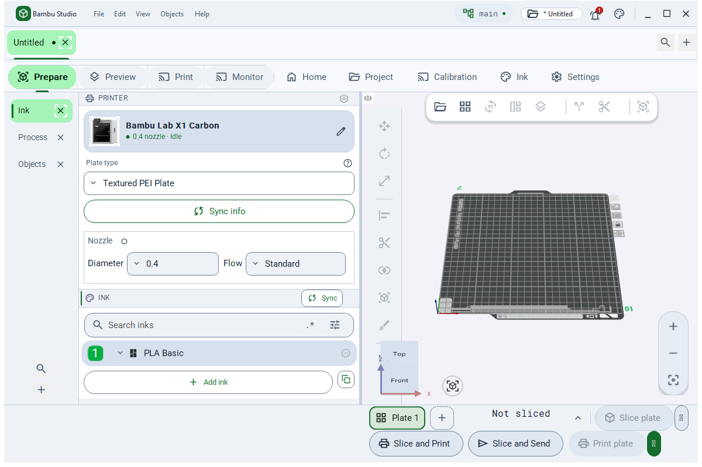 |  |

**Prepare — with the browser-like project tab bar**

The new project tab strip (one tab per open project, a close button, and a "+" new-tab button) sits
between the Material title bar and the workspace tabs. This capture is new from `md3-v231`.

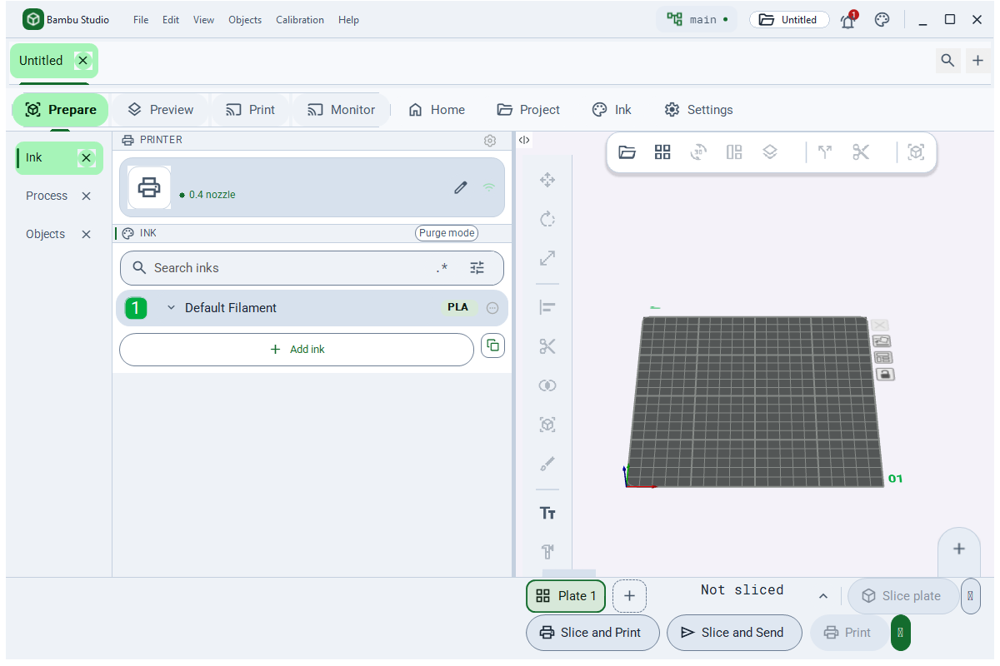

The Home tab and the Setup Wizard body are WebView2 pages. The two images below are earlier
2026-09-06 window captures in which the web content did render; on the `md3-v231` runner the Home
page rendered blank and the Setup Wizard capture was withheld, so neither image was replaced:

| Prepare sidebar (`md3-v231`) | First-run Setup Wizard welcome page (earlier capture, 2026-09-06) |
| :---: | :---: |
| 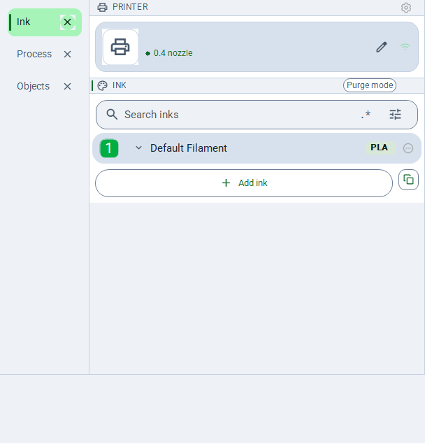 |  |

The Prepare sidebar capture shows the section rail (Ink, Process, Objects), the Printer card, and
the Ink card with its search field and **Add ink** action; the Process and Objects sections are not
in this view. The Setup Wizard is hosted on the Material dialog shell (rounded surface, header icon
tile) in place of the legacy native caption.

#### Feature gallery — every page, every button

The full screenshot matrix lives under [`docs/screenshots/`](docs/screenshots/): **one capture per
page and one per button** for every feature, taken headlessly from the real running app
(`PrintWindow` for the native surfaces, rendered page HTML for some webview surfaces). The images
shown here come from different runs: four are new from `md3-v231` (the toast, Version history,
Config profiles, and the "after" process sidebar), and the rest are earlier captures. The
[screenshot provenance](#screenshot-provenance) table lists each one.

**Non-blocking notifications** — informational messages are corner toasts, not modal dialogs. This
`md3-v231` capture shows the dark inverse-surface snackbar over the live Prepare scene; the capture
driver raised a sample notification, and no model is loaded.

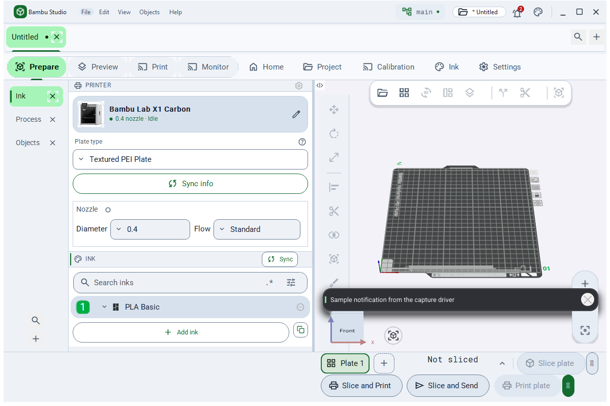

| Version history (local Git snapshots) | Regex builder (on every search bar) |
| :---: | :---: |
|  | 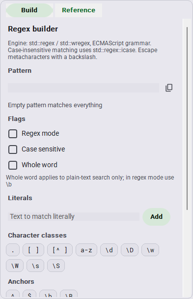 |

| Appearance settings (theme / density / accent / font) — plus a per-element editor: right-click ▸ *Edit appearance...* or Ctrl+Shift+E ([docs](docs/features/windows/appearance-editor.md)) | Project tabs (one tab per project) |
| :---: | :---: |
| 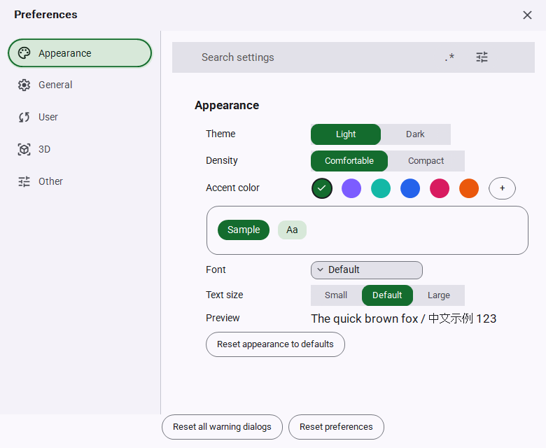 |  |

| Preferences · General | Preferences · Other |
| :---: | :---: |
| 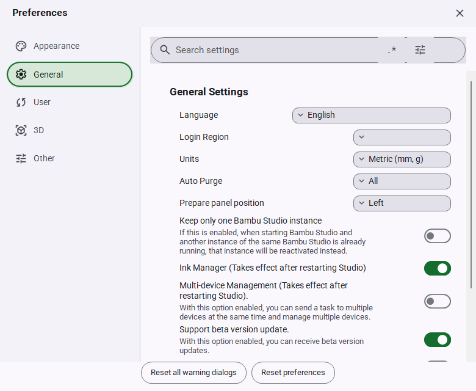 | 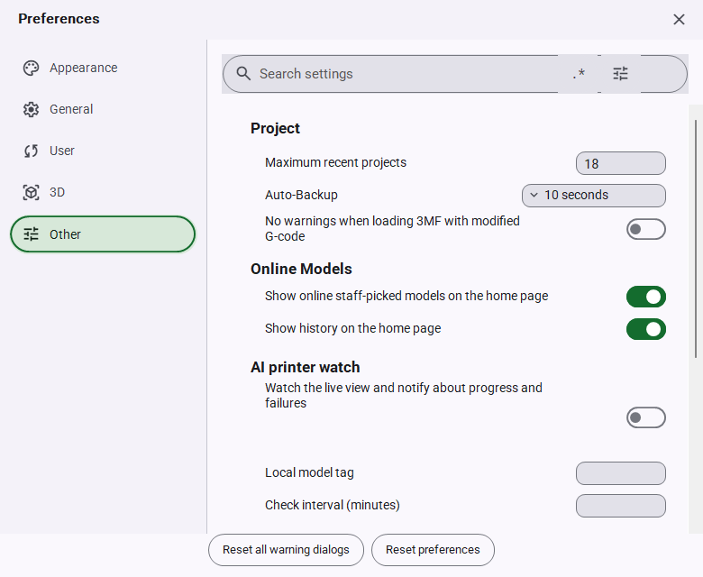 |

The [latest Preferences startup and tab-navigation captures](docs/screenshots/preferences/tabstrip-fix/) show the repaired build opening Appearance and switching to General after a missing export image blocked startup.

| File menu (Version history · Open in External Editor) | Setup Wizard · Ink Selection |
| :---: | :---: |
| 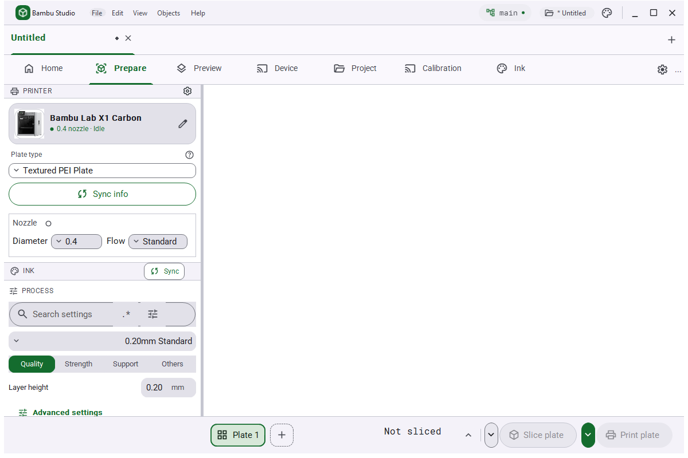 | 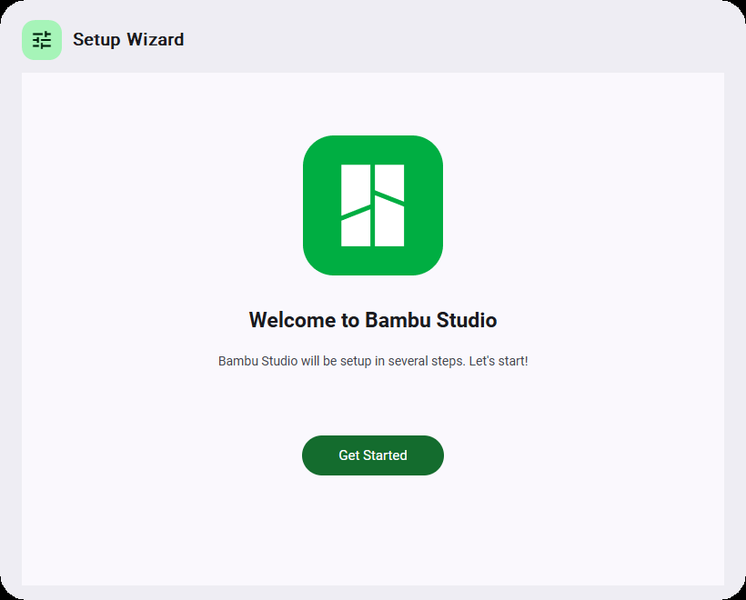 |

Neither of these earlier captures shows its subject: the File menu capture is the main window with
**File** highlighted, because the popup menu is not part of a `PrintWindow` capture, and the Ink
Selection capture shows the wizard's "File not found" page.

| Config profiles & backup (slide-to-confirm export) | Settings search field (a crop of the field only) |
| :---: | :---: |
| 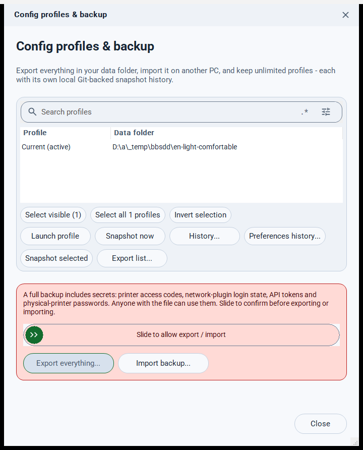 | 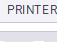 |

**Prepare sidebar · process settings** — the full process tree is the settings-tab layout hosted in
the sidebar, so Advanced mode widens the dock (weakly: capped at 55% of the frame, grow-only, and
the sash stays draggable) and the body gained a real horizontal scrollbar as a backstop. The header
row had been over-subscribed badly enough that the `Process` title and the Compare button were
allocated **zero width** and vanished. Details and measurements:
[`docs/features/prepare/process-settings-sidebar.md`](docs/features/prepare/process-settings-sidebar.md).

| Before (2026-07-30) — values cut off, title and Compare button gone | After (`md3-v231`) — the whole sidebar, nothing cut off |
| :---: | :---: |
| 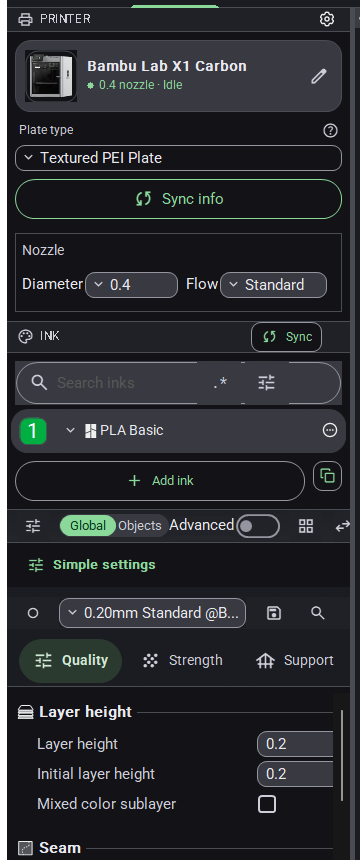 | 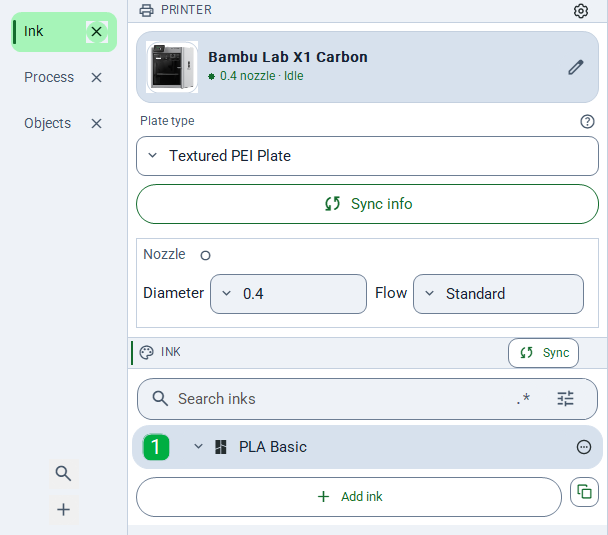 |

| Header before (starved, 2026-07-30) | Header after (earlier capture, 2026-09-06) |
| :---: | :---: |
| 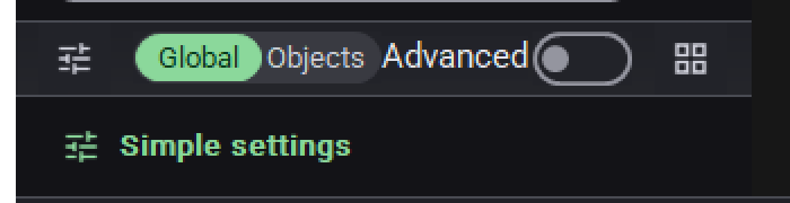 | 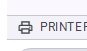 |

The two "before" images are headless captures of a Release build at an 846-pixel frame width,
showing the sidebar before the fix (committed 2026-07-30). The new "after" sidebar is open on its
Ink section, with the Printer card's plate type and nozzle fields and the Ink card fully inside the
panel; the process values themselves are not in this view. The "header after" image is an earlier
crop that shows only the `PROCESS` section title, not the header row; its `md3-v231` retake, now
aimed at the whole header row, was not done.

Per-feature folders with every button close-up: [notifications](docs/screenshots/notifications/) ·
[version-history](docs/screenshots/version-history/) · [regex-builder](docs/screenshots/regex-builder/) ·
[appearance](docs/screenshots/appearance/) · [preferences](docs/screenshots/preferences/) ·
[project-tabs](docs/screenshots/project-tabs/) · [main-window](docs/screenshots/main-window/) ·
[home](docs/screenshots/home/) · [wizard](docs/screenshots/wizard/) ·
[config-profiles](docs/screenshots/config-profiles/) · [smart-home](docs/screenshots/smart-home/) ·
[sidebar-process](docs/screenshots/sidebar-process/)

#### Earlier installed-app captures

These four file names come from an installed-app set reviewed on 2026-07-20, but none of the images
is from that set any more. Project Version History is new from `md3-v231` and is the same image as
the Version history dialog above. The other three were last written on 2026-09-06 by a recapture
pass on build attempt 20 of `main` at `84f6bc5c9` and are kept because their `md3-v231` retakes were
rejected (Home and Ink: blank embedded web pages) or not done (Device). Two of those three show the
Prepare page rather than their subject: that pass's Filament Manager recipe opened Prepare (the
recipe has since been corrected; see
[README screenshots](docs/features/automation/readme-screenshots.md)), and the Device plug-in gate
image shows Prepare as well.

| Home (earlier capture, 2026-09-06) | Filament Manager file name; shows the Prepare page (2026-09-06) |
| :---: | :---: |
| 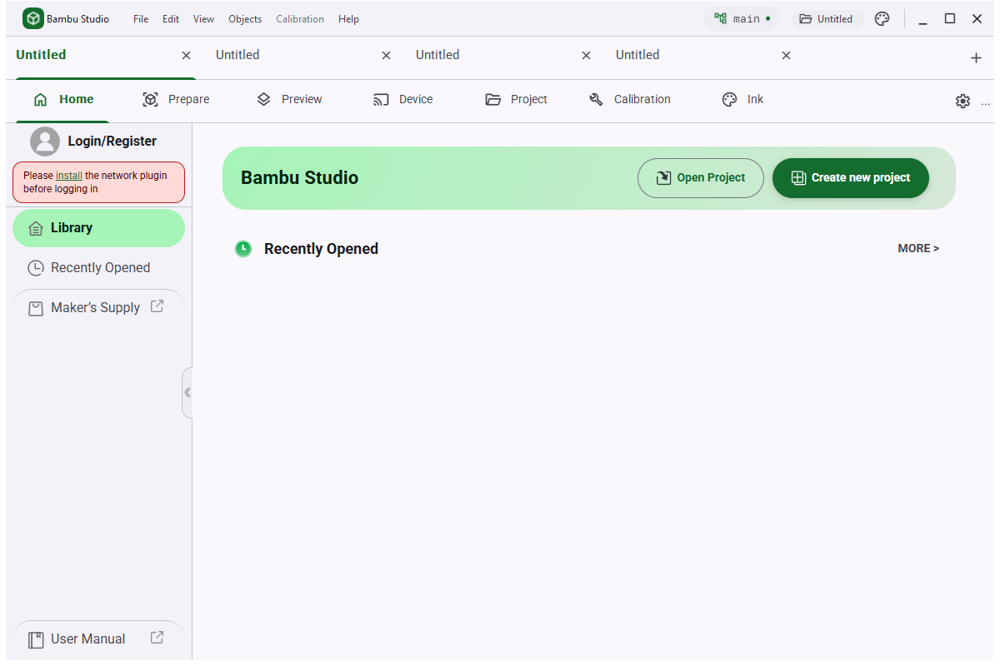 | 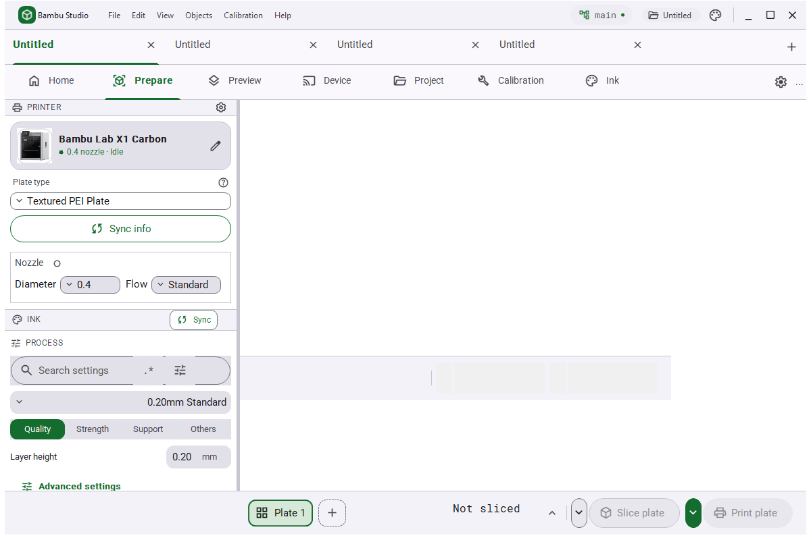 |

| Device plug-in gate file name; shows the Prepare page (2026-09-06) | Project Version History (`md3-v231`) |
| :---: | :---: |
| 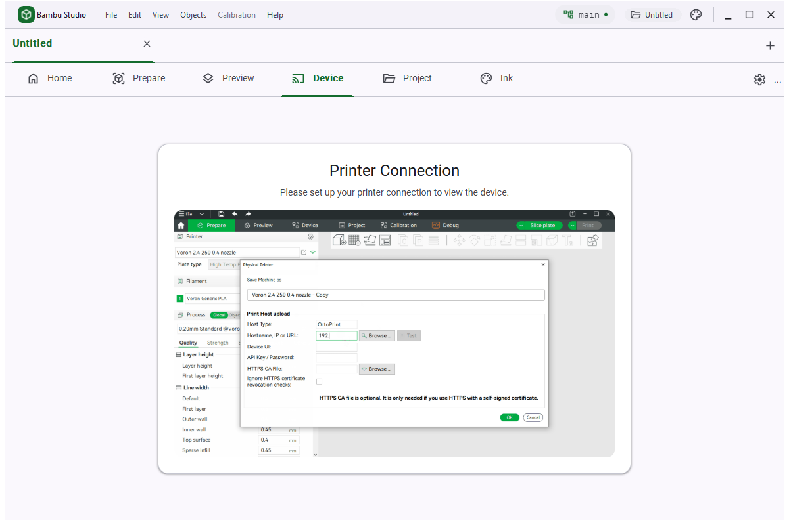 | 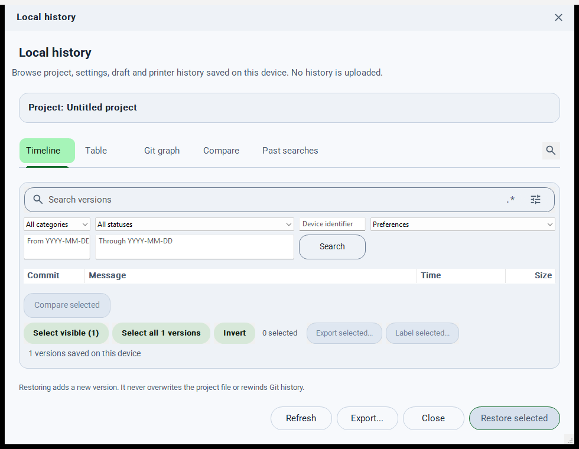 |

### Interactive design reference

The images below are deterministic captures of the separate [`ui-md3`](ui-md3/) interactive design
reference, not screenshots of the native application. Select an image to open the same reference
screen, theme, density, accent, and language state. The installed-app captures are the separate
gallery above.

The three design-reference images below were retaken on 2026-10-09 by the same README screenshot
workflow, target `design-references`, from source commit
[`e7c4e7c6f7e8fa81d0ba562ce87eee5703402950`](https://github.com/Ding-Ding-Projects/BambuStudio/commit/e7c4e7c6f7e8fa81d0ba562ce87eee5703402950)
in the second attempt of
[run 37864716163](https://github.com/Ding-Ding-Projects/BambuStudio/actions/runs/37864716163). The
job composed the Pages site from that commit, served it on the runner's loopback interface, and
took each linked URL in headless Chrome at 1600x1000 with a pinned Noto Sans CJK font. Each image
passed the privacy check and was reviewed before it was committed. The illustration directly below
is generated artwork from the
[visual showcase](docs/features/design-system/generated-visual-showcase.md), not a capture.

[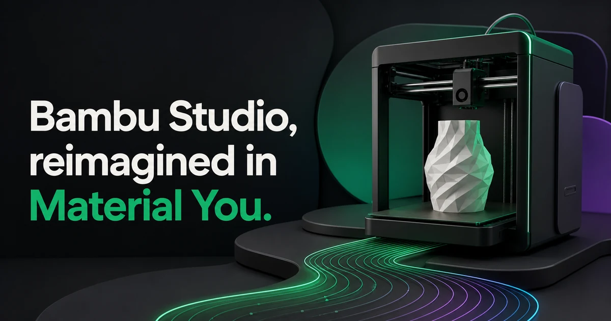](https://ding-ding-projects.github.io/BambuStudio/)

The Pages site is a **browser-style tabbed application**, not a scrolling landing page: eight tabs
with a strip you can pin, drag, group and search; English and Hong Kong Cantonese copy at five funny
levels per language on two independent sliders; a full ECMAScript regex builder behind every search
bar; a changelog viewer covering every published release; and a one-in-ten dim sum surprise.
Code, fonts and interface artwork are served from this repository with no CDN, analytics or
trackers. On an eligible repeat visit, the surprise loads one published photo from the public
dim-sum catalog without sending a referrer. Deployment is gated on 447 measured layout cases in a
real headless browser.
[Open the site](https://ding-ding-projects.github.io/BambuStudio/), read the
[site documentation](docs/features/pages/README.md), or see the
[visual showcase documentation](docs/features/design-system/generated-visual-showcase.md).

**Prepare · light theme · English**

[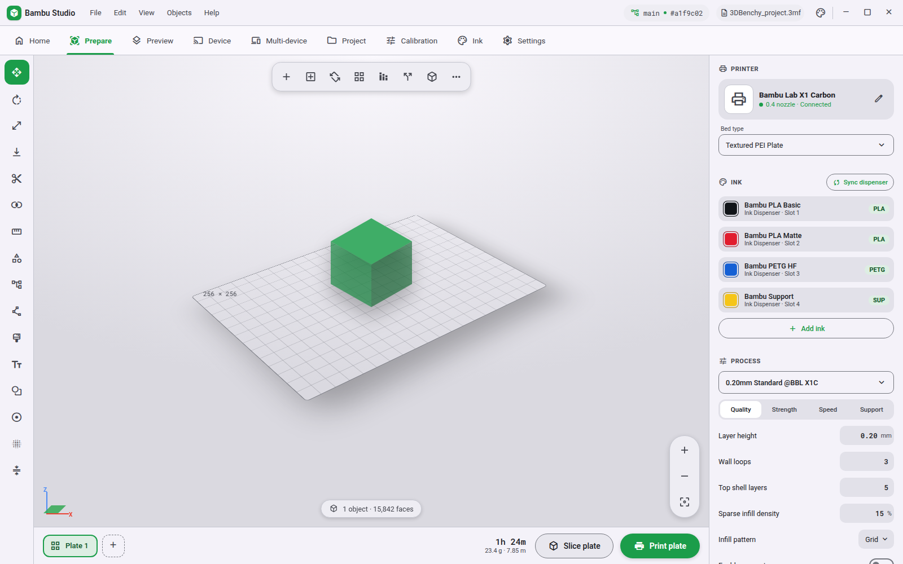](https://ding-ding-projects.github.io/BambuStudio/app/?view=prepare&theme=light&density=comfortable&accent=%2322c55e&lang=en)

| Preview · dark theme · Hong Kong Cantonese | Device · compact dark theme · English + Cantonese |
| :---: | :---: |
| [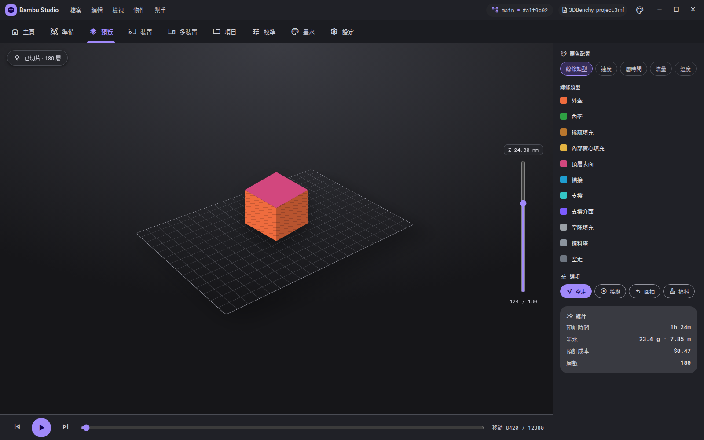](https://ding-ding-projects.github.io/BambuStudio/app/?view=preview&theme=dark&density=comfortable&accent=%237c5cff&lang=yue_HK) | [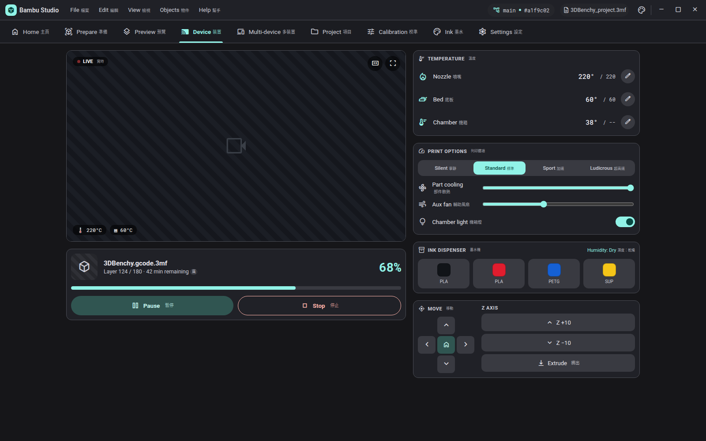](https://ding-ding-projects.github.io/BambuStudio/app/?view=device&theme=dark&density=compact&accent=%2314b8a6&lang=bilingual_en_yue_HK) |

### Screenshot provenance

Every screenshot in this README, in the order it appears. **New** images were captured on
2026-10-09 and committed after review; **earlier** images were not replaced then, and their date is
the date of the commit that last wrote the file. File names did not change when images were
retaken, so a date or commit in a file name is not its source.

Capture routes:

- **A**: [README screenshot workflow](docs/features/automation/readme-screenshots.md), target
  `native-app`, [run 37875388464](https://github.com/Ding-Ding-Projects/BambuStudio/actions/runs/37875388464):
  release `md3-v231` installed and verified on a hosted Windows runner, then captured on a hidden
  desktop at 1920x1080 with Mesa llvmpipe, as a `PrintWindow` window capture or a crop of one.
- **B**: the same workflow, target `design-references`,
  [run 37864716163](https://github.com/Ding-Ding-Projects/BambuStudio/actions/runs/37864716163)
  (second attempt): the Pages app composed from the source commit and rendered in headless Chrome at
  1600x1000.
- **C**: an earlier `scripts/md3/recapture.py` pass on a build of `main`, on a hidden desktop, as a
  `PrintWindow` window capture or a crop of one; the commit that wrote the file names the build.
- **D**: an earlier headless capture of a Release build at an 846-pixel frame width, showing the
  sidebar before the process-sidebar fix; committed in `b35f078d5`.

| Image | What it shows | Source | Route | Date |
| --- | --- | --- | --- | --- |
| `docs/readme-assets/yum-20260811-native-main-ca49.png` | Main window on Prepare with the project tab bar, the Bambu Lab X1 Carbon card and an empty plate | New: `md3-v231` (`31410274b`) | A | 2026-10-09 |
| `docs/readme-assets/yum-20260811-wizard-ca49.png` | Setup Wizard welcome page | Earlier: build attempt 20 of `main` at `84f6bc5c9`; the `md3-v231` retake was withheld by the privacy check (`image-bytes`) | C | 2026-09-06 |
| `docs/readme-assets/shot-prepare-frame.png` | Main window on Prepare with the project tab bar, the default ink and an empty plate | New: `md3-v231` (`31410274b`) | A | 2026-10-09 |
| `docs/readme-assets/shot-home.png` | Home tab with its web page and four project tabs | Earlier: build attempt 20, `84f6bc5c9`; the retake was rejected because the Home web page rendered blank | C | 2026-09-06 |
| `docs/readme-assets/shot-prepare-sidebar.png` | Prepare sidebar: section rail, Printer card and Ink card | New: `md3-v231` (`31410274b`) | A | 2026-10-09 |
| `docs/readme-assets/shot-wizard.png` | Setup Wizard welcome page | Earlier: build attempt 20, `84f6bc5c9`; the retake was withheld (`image-bytes`) | C | 2026-09-06 |
| `docs/screenshots/notifications/toast-info.png` | Prepare window with a sample info toast raised by the capture driver | New: `md3-v231` (`31410274b`) | A | 2026-10-09 |
| `docs/screenshots/version-history/history-dialog.png` | Local history dialog on its Timeline tab | New: `md3-v231` (`31410274b`) | A | 2026-10-09 |
| `docs/screenshots/regex-builder/builder-popover.png` | Regex builder popover on its Build tab | Earlier: build attempt 19 of `main` at `2cf53a936`; the retake was not done | C | 2026-09-06 |
| `docs/screenshots/appearance/appearance-tab.png` | Preferences, Appearance tab | Earlier: build attempt 19, `2cf53a936`; not done | C | 2026-09-06 |
| `docs/screenshots/project-tabs/tab-bar-two-tabs.png` | Project tab bar with seven Untitled tabs | Earlier: build attempt 20, `84f6bc5c9`; not done | C | 2026-09-06 |
| `docs/screenshots/preferences/general-tab.png` | Preferences, General tab | Earlier: build attempt 19, `2cf53a936`; not done | C | 2026-09-06 |
| `docs/screenshots/preferences/other-tab.png` | Preferences, Other tab | Earlier: build attempt 20, `84f6bc5c9`; not done | C | 2026-09-06 |
| `docs/screenshots/main-window/menu-file.png` | Main window on Prepare with **File** highlighted; no menu is open and the 3D canvas is blank | Earlier: build attempt 20, `84f6bc5c9`; not done | C | 2026-09-06 |
| `docs/screenshots/wizard/wizard-step-22.png` | Setup Wizard showing a "File not found" page, not Ink Selection | Earlier: build attempt 23 of `main` at `2dcc26658`; the retake was withheld (`image-bytes`) | C | 2026-09-06 |
| `docs/screenshots/config-profiles/dialog.png` | Config profiles & backup dialog with the slide-to-confirm export | New: `md3-v231` (`31410274b`) | A | 2026-10-09 |
| `docs/screenshots/sidebar-process/after-search-settings.png` | Crop of the Search settings field | Earlier: build attempt 19, `2cf53a936`; not done | C | 2026-09-06 |
| `docs/screenshots/sidebar-process/before-sidebar-clipped.png` | Dark Prepare sidebar with its process values cut off, before the fix | Earlier: historical evidence of a fixed defect, never retaken | D | 2026-07-30 |
| `docs/screenshots/sidebar-process/after-sidebar-readable.png` | Prepare sidebar on its Ink section, with the Printer card's plate type and nozzle fields | New: `md3-v231` (`31410274b`) | A | 2026-10-09 |
| `docs/screenshots/sidebar-process/before-header-starved.png` | Dark settings header row without the Process title, before the fix | Earlier: historical, never retaken | D | 2026-07-30 |
| `docs/screenshots/sidebar-process/after-header-intact.png` | Crop of the `PROCESS` section title only | Earlier: build attempt 19, `2cf53a936`; not done | C | 2026-09-06 |
| `docs/readme-assets/native-material-home-light-en.png` | Home tab with its web page and four project tabs | Earlier: build attempt 20, `84f6bc5c9`; the retake was rejected because the Home web page rendered blank | C | 2026-09-06 |
| `docs/readme-assets/native-material-filament-manager-light-en.png` | Prepare page, not the Ink page | Earlier: build attempt 20, `84f6bc5c9`; the retake was rejected because the Ink web page rendered blank | C | 2026-09-06 |
| `docs/readme-assets/native-material-device-plugin-gate-light-en.png` | Prepare page, not the Device tab | Earlier: build attempt 20, `84f6bc5c9`; not done | C | 2026-09-06 |
| `docs/readme-assets/native-material-project-history-light-en.png` | Local history dialog, the same image as `history-dialog.png` | New: `md3-v231` (`31410274b`) | A | 2026-10-09 |
| `docs/readme-assets/material-prepare-light-en.png` | Pages design reference: Prepare, light theme, English | New: Pages app at `e7c4e7c6f` | B | 2026-10-09 |
| `docs/readme-assets/material-preview-dark-yue-hk.png` | Pages design reference: Preview, dark theme, Hong Kong Cantonese | New: Pages app at `e7c4e7c6f` | B | 2026-10-09 |
| `docs/readme-assets/material-device-dark-bilingual.png` | Pages design reference: Device, compact dark theme, English + Cantonese | New: Pages app at `e7c4e7c6f` | B | 2026-10-09 |

Not in the table: the banner at the top of this README is inherited from upstream Bambu Studio's
README, and the Pages social card in the design-reference section is generated artwork; neither is
a capture of this fork.

## Home Assistant printer handover

The native Smart home dialog implements two explicit ways to add currently accessible printers to
the companion
[`Ding-Ding-Projects/ha-bambulab`](https://github.com/Ding-Ding-Projects/ha-bambulab) integration:
a confirmed service call through the user's Home Assistant long-lived token, or a temporary local
discovery window that needs no Home Assistant token. Both paths disclose that printer LAN access
codes are credentials before transfer. Discovery sharing is off by default, uses a fresh
high-entropy pairing capability, and stops when the toggle is disabled or the dialog closes.
Home Assistant work uses owned bounded queues, coalesces Connect and volume-slider bursts, caps
printer/speaker/light fan-out at 32, imports printers in four-wide waves, paces mDNS replies, and
cancels and joins its workers during app shutdown. If shutdown lands after an alert-light scene is
created but before any flash, the unused scene is deleted instead of leaking. The resizable Smart
home dialog keeps its footer fixed around a scrolling body and is implemented to wrap long English,
Cantonese, and bilingual content instead of clipping it.

The focused Windows Release targets build successfully: `home_assistant_tests` passes 30 test cases
and 267 assertions, all five focused CTest entries pass, the Cantonese catalog contains 718 checked
translations, the static Pages/i18n/clipping suite passes 50/50, and the browser Pages matrix passes all 447
cases — 156 on the landing page, 288 that activate every tab, and 3 compact corner-surface cases. Ubuntu's CJK font metrics then exposed the translated
**Screens / 畫面** header target shrinking to 31.984×44 pixels at two desktop widths; commit
[`32a5cc6d7`](https://github.com/Ding-Ding-Projects/BambuStudio/commit/32a5cc6d79e40a46d3c1758052fbdeac5c01f1a3)
adds a 44-pixel width floor, and hosted Pages
[run 30359493216](https://github.com/Ding-Ding-Projects/BambuStudio/actions/runs/30359493216)
passes the full matrix. The production sharing probe also completed cross-host
PTR/SRV/TXT/A discovery, one authenticated bounded fetch, and the zero-TTL goodbye. The full
`BambuStudio_app_gui` Release build exited successfully after 3,387 seconds, followed by an
8.3-second no-change build. Native headless review at 720×760 and the declared 520×480 minimum found
text actions incorrectly squeezed to 44 DIP; after the responsive-action fix, a 141-second focused
rebuild and link plus an 8.0-second no-change build passed. The later nonvisual import-scheduling
and cancellation-cleanup fixes compiled and linked in 214.808 seconds; the final no-change build took
8.544 seconds. The final 151,299,584-byte DLL is timestamped `2026-07-28 08:15:46 -04:00`, with
SHA-256 `41BB1BFC754E3184C5908E2145A93E3640D3866E59380F32EEFF7A76F418E972`.
The primary corrected English captures were recaptured from that exact final DLL and are in
[`docs/screenshots/smart-home/`](docs/screenshots/smart-home/). The media-action close-up remains
from the preceding `EBF646…` DLL; the later source fixes changed only nonvisual printer scheduling
and alert-light cleanup, not `SmartHomeDialog` or `MsgDialog` layout. Native bilingual capture, live Home
Assistant confirmation and service paths, physical-printer success, and the still-running Windows
release verdict are tracked separately in
[issue #16](https://github.com/Ding-Ding-Projects/BambuStudio/issues/16). The implementation and
44-pixel correction are pushed and remotely proven; this summary still does not substitute for
the remaining live-runtime evidence. See
[Smart home](docs/features/windows/smart-home.md) for behavior, security, failure modes, and the
honest verification boundary, and
[Home Assistant printer-discovery API](docs/features/api/home-assistant-printer-discovery.md) for
the temporary HTTP/mDNS contract and Postman collections.

## Windows installer

The supported Windows installer is Squirrel.Windows. It produces the standard unsigned
`Setup.exe`, `RELEASES` feed index, full `.nupkg`, and any delta packages Squirrel can generate,
alongside a SHA-256 sidecar and CycloneDX SBOM. The package records the exact source commit in its
NuGet metadata, and the release workflow verifies the package layout and unsigned Authenticode
status before publication. The old NSIS UI-page path is retired; local source builds remain
available through the documented one-click build scripts. See [Windows native installer](docs/features/releases/windows-native-installer.md),
[Windows one-click build](docs/features/releases/windows-one-click-build.md), and
[Build from source](docs/features/releases/windows-build-from-source.md).

## Project history

The native app includes app-local, Git-backed version history for `.3mf` projects. Each retained
revision is a complete project snapshot in an isolated bare repository below Bambu Studio's data
directory, never a `.git` directory beside the user's project. Automatic edits and completed manual
saves are queued in order; identical snapshots are suppressed. **File → Version history** lists and
restores revisions without directly overwriting the saved project, and **Save As** forks the existing
history to the new project identity when it is safe to do so.

History is local to this device: it is not pushed to the source-code repository, synced to another
computer, or a replacement for backups. There is not yet a retention or pruning policy, so storage
can grow with project size and edit count. A restore changes the open session; the project file is
only replaced when the user explicitly saves it.

The Windows pipeline builds the native application, produces a per-file CycloneDX 1.6 SBOM, packages
the payload with Squirrel.Windows, and creates GitHub provenance and SBOM attestations for `Setup.exe`.
It validates the Squirrel feed, full package, checksum, empty PE security directory (unsigned
Setup.exe), and SBOM in a
draft before publication and refuses to publish unless repository immutable releases are enabled.
The last historical publish pipeline proof is hosted run
[`29877040307`](https://github.com/Ding-Ding-Projects/BambuStudio/actions/runs/29877040307)
completed with both `Build BambuStudio` and `Publish Windows release` succeeding and published the
non-draft NSIS-era release
[`md3-windows-v02.08.01.55-r37`](https://github.com/Ding-Ding-Projects/BambuStudio/releases/tag/md3-windows-v02.08.01.55-r37)
(installer, SHA-256 checksum, CycloneDX SBOM). New releases ship `Setup.exe`, `RELEASES`, the full
Squirrel package, any delta packages, the sidecar, and SBOM. When an org-side restriction began returning HTTP 403 on release
creation with the workflow token, the publish step was switched to authenticate with the
`TOKEN_GITHUB` owner PAT (commit `fc7257366`, falling back to the workflow token where the secret
is absent); release `r56` was published manually from run artifacts during that incident. GitHub
attestations and checksums are not Authenticode signatures; configuring a trusted Windows signing
identity remains external work. Local release checks are the evidence boundary for the current
Squirrel migration; a cancelled or pending hosted run is not treated as green. See
[`HANDOFF.md`](HANDOFF.md) for the authoritative, current CI state.

Bambu Studio is based on [PrusaSlicer](https://github.com/prusa3d/PrusaSlicer) by Prusa Research, which is from [Slic3r](https://github.com/Slic3r/Slic3r) by Alessandro Ranellucci and the RepRap community.

See this fork's [wiki](https://github.com/Ding-Ding-Projects/BambuStudio/wiki),
[feature documentation](docs/README.md), [roadmap](ROADMAP.md), and [handoff](HANDOFF.md) for the
MD3 rewrite, verification status, and Windows release details. The original documentation remains in
[`doc/`](doc/).

# What are Bambu Studio's main features?
Key features are:

- Basic slicing features & GCode viewer
- Multiple plates management
- Remote control & monitoring
- Explicit Home Assistant printer handover and short-lived local discovery
- Auto-arrange objects
- Auto-orient objects
- Hybrid/Tree/Normal support types, Customized support
- multi-material printing and rich painting tools
- Upstream multi-platform source support; this fork accepts native Windows releases only
- Global/Object/Part level slicing parameters

Other major features are:

- Advanced cooling logic controlling fan speed and dynamic print speed
- Auto brim according to mechanical analysis
- Support arc path(G2/G3)
- Support STEP format
- Assembly & explosion view
- Flushing transition-filament into infill/object during filament change

# How to compile on Windows

For a local Release installer, double-click [`OneClickBuildInstaller.cmd`](OneClickBuildInstaller.cmd).
Automation and fresh checkouts can use the root [`build.bat`](build.bat) and
[`build-installer.bat`](build-installer.bat) entry points; `/s`, `--silent`, or `SILENT=1` keeps either
path non-interactive. `build.bat` leaves a runnable Release payload, while `build-installer.bat`
produces the unsigned Squirrel.Windows `Setup.exe`, `RELEASES` feed, full package, any generated
delta packages, SHA-256 sidecar, and CycloneDX SBOM through the same supported toolchain. Neither
script launches the app or publishes a release.
It detects and installs missing ordinary prerequisites, builds dependencies and Bambu Studio,
stages the payload, and writes Squirrel artifacts under `artifacts/windows/squirrel/` plus the
CycloneDX SBOM, SHA-256 checksum, and detailed log under `artifacts/windows/`. See the
[one-click Windows build guide](docs/features/releases/windows-one-click-build.md) for clean,
bootstrap-only, plan, and explicit post-build install modes.

Use the upstream
[Windows compile guide](https://github.com/bambulab/BambuStudio/wiki/Windows-Compile-Guide) for a
developer build. Non-developers who want a locally compiled build can instead use the installer's
interactive [Build from source mode](docs/features/releases/windows-build-from-source.md), which
bootstraps the toolchain and runs the same documented build path. The fork's release configuration
is encoded in
[`.github/workflows/build_bambu.yml`](.github/workflows/build_bambu.yml) and is orchestrated by
[`.github/workflows/build_all.yml`](.github/workflows/build_all.yml). The release workflow enables
native C++ tests and packages the installed payload with Squirrel.Windows; see the
[Windows CI and supply-chain documentation](docs/features/releases/windows-release-supply-chain.md)
before treating a local build as equivalent to a published artifact.

# Report issue
You can add an issue to the [github tracker](https://github.com/bambulab/BambuStudio/issues) if **it isn't already present.**

# License
Bambu Studio is licensed under the GNU Affero General Public License, version 3. Bambu Studio is based on PrusaSlicer by PrusaResearch.

PrusaSlicer is licensed under the GNU Affero General Public License, version 3. PrusaSlicer is owned by Prusa Research. PrusaSlicer is originally based on Slic3r by Alessandro Ranellucci.

Slic3r is licensed under the GNU Affero General Public License, version 3. Slic3r was created by Alessandro Ranellucci with the help of many other contributors.

The GNU Affero General Public License, version 3 ensures that if you use any part of this software in any way (even behind a web server), your software must be released under the same license.

The bambu networking plugin is based on non-free libraries. It is optional to the Bambu Studio and provides extended networking functionalities for users.
By default, after installing Bambu Studio without the networking plugin, you can initiate printing through the SD card after slicing is completed.

