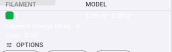
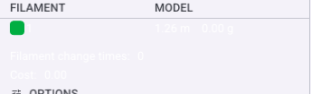

# Toolpath color-scheme legend

The Preview page overlays an ImGui legend on the sliced-toolpath viewport. It is drawn
by `BaseRenderer::render_legend` in
[`src/slic3r/GUI/GCodeRenderer/BaseRenderer.cpp`](../../../src/slic3r/GUI/GCodeRenderer/BaseRenderer.cpp),
shared by the Legacy and Advanced renderers. The legend restyles to MD3 tokens
(SectionHeader titles, `OnSurfaceVariant` column headers, a `SurfaceContainerHigh`
rounded backing) but its data colours (filament swatches, range ramps) are functional
and left untouched.

## Anatomy

Top to bottom, for the default **Filament** (ColorPrint) scheme:

1. **Color scheme** section — `Line Type · Speed · Layer Time · Flow · Temperature`
   buttons that pick the active `EViewType`.
2. **`FILAMENT | MODEL` usage table** — one row per used filament: a rounded colour
   swatch under `FILAMENT`, and length/weight (`1.26 m  0.00 g`, or imperial) under
   `MODEL`. When support / flushed / wipe-tower / total columns apply, they are added
   the same way and a `Total` summary row is appended.
3. **Summary lines** — greyed `Filament change times` and `Cost`, shown below the table.
4. **Options** chips — Travel / Retract / Unretract / Wipe / Seams toggles.
5. **Time estimation** card — prepare / model-printing / total time.

## Column alignment

Column x-offsets are computed once per frame by the local `calculate_offsets` lambda
from the header labels plus the widest cell in each column, then clamped to at least an
even share of the window width. The **same** offset vector is consumed by both
`append_headers` (the `FILAMENT` / `MODEL` titles) and `append_item` (each value row) —
for ColorPrint they are keyed by column name through the `color_print_offsets` map. Because
header and value share one offset source, the `MODEL` value always sits directly under its
header; there is no separate alignment path to drift out of sync.

## Summary-line spacing

`Filament change times` and `Cost` are plain label/value lines rather than table rows, so
they do not go through `append_item` (which pushes the table's own `ItemSpacing.y`). They
are wrapped in the table's row advance and preceded by a spacer so they read as a grouped
footer instead of crowding the last value row:

```cpp
ImGui::PushStyleVar(ImGuiStyleVar_ItemSpacing,
                    ImVec2(ImGui::GetStyle().ItemSpacing.x, 6.0f * m_scale)); // == table rows
ImGui::Dummy({ window_padding, window_padding });   // break from the table
ImGui::Dummy({ window_padding, window_padding }); ImGui::SameLine();
imgui.text(_u8L("Filament change times") + ":"); /* … value … */
ImGui::Dummy({ window_padding, window_padding }); ImGui::SameLine();
imgui.text(_u8L("Cost") + ":");                  /* … value … */
ImGui::PopStyleVar(1);
```

`6.0f * m_scale` matches the per-row `ItemSpacing.y` used by `append_item`, so the footer
advances at the same rhythm as the table above it at every display scale.

Before / after the spacing fix (`809a230d6`), same crop coordinates:

| Before (crowded) | After (spaced) |
| --- | --- |
|  |  |

## Failure modes

- **Crowded footer** (fixed): without the wrapped `ItemSpacing.y`, the summary lines fell
  back to the default (smaller) spacing and butted against the swatch/value row.
- **Empty state**: with no slice, `render_legend` is not reached; the table only appears
  once `m_print_statistics` is populated.
- **Long localized labels**: the bilingual / Cantonese modes widen the `FILAMENT` /
  `MODEL` headers; `calculate_offsets` measures the header text, so columns still align,
  but validate narrow docks when adding columns.

## Security considerations

The legend renders only locally-computed slice statistics; it takes no untrusted input and
performs no I/O. Values are formatted with fixed-width `sprintf` into bounded buffers.

## Verification

Verified headlessly on the GPU-less build VM (Mesa llvmpipe + PrintWindow): launch, load a
cube via the running instance, slice (auto-switches to Preview), then PrintWindow-capture
the frame and crop the legend. See the `lowlevel-mcp-headless-driving` agent memory for the
exact drive/capture recipe. The before/after crops above were produced this way against the
pre- and post-fix builds.
