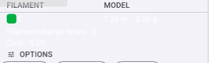
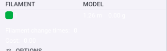

> 英文原文：[Toolpath color-scheme legend](toolpath-legend.md)

# 工具路徑色彩方案圖例

預覽頁面喺切片工具路徑視口上疊加一個 ImGui 圖例。佢係由 `BaseRenderer::render_legend` 喺 [`src/slic3r/GUI/GCodeRenderer/BaseRenderer.cpp`](../../../src/slic3r/GUI/GCodeRenderer/BaseRenderer.cpp) 中繪製、由傳統同埋進階渲染器共用。圖例重新樣式化為 MD3 令牌（SectionHeader 標題、`OnSurfaceVariant` 欄標題、一個 `SurfaceContainerHigh` 圓角背景）但佢嘅資料顏色（墨水樣本、範圍斜坡）係函數式同埋左唔觸及。

## 結構

由上到下、對於預設嘅**墨水**（ColorPrint）方案：

1. **色彩方案**部分、`線類型・速度・層時間・流量・溫度`按鈕挑選活躍嘅 `EViewType`。
2. **`墨水 | 模型`使用表**、每個使用嘅墨水一列：一個圓角顏色樣本喺 `墨水` 下、同埋長度同埋重量（`1.26 m  0.00 g`、或英制）喺 `模型` 下。當支援同埋清潔同埋擦拭塔同埋總列適用時、佢們以同樣方式被添加同埋一個 `總計`摘要列被附加。
3. **摘要列**、灰色 `墨水更換時間`同埋 `成本`、顯示喺表下面。
4. **選項晶片**、旅遊同埋回縮同埋未回縮同埋擦拭同埋接縫切換。
5. **時間估計**卡、準備同埋模型打印同埋總時間。

## 欄對齁

欄 x 偏移量係由本地 `calculate_offsets` lambda 每幀計算一次、來自標題標籤加上每列嘅最寬儲存格、然後被限制到至少視窗寬度嘅均勻份額。**相同**偏移向量被消費由 `append_headers`（`墨水` 同埋 `模型`標題）同埋 `append_item`（每個值列）、對於 ColorPrint、佢們通過 `color_print_offsets` 映射以欄名稱做鍵。因為標題同埋值共用一個偏移源、`模型`值總是直接坐喺佢嘅標題下方；冇單獨嘅對齁路徑會偏離同步。

## 摘要列間距

`墨水更換時間`同埋 `成本`係簡單標籤同埋值列而唔係表列、所以佢們唔經過 `append_item`（推表佢自己嘅 `ItemSpacing.y`）。佢們被包裹喺表嘅列前進同埋前面一個間隔器、所以佢們讀起來象一個分組頁腳而唔係擁擠最後值列：

```cpp
ImGui::PushStyleVar(ImGuiStyleVar_ItemSpacing,
                    ImVec2(ImGui::GetStyle().ItemSpacing.x, 6.0f * m_scale)); // == table rows
ImGui::Dummy({ window_padding, window_padding });   // break from the table
ImGui::Dummy({ window_padding, window_padding }); ImGui::SameLine();
imgui.text(_u8L("Filament change times") + ":"); /* … value … */
ImGui::Dummy({ window_padding, window_padding }); ImGui::SameLine();
imgui.text(_u8L("Cost") + ":");                  /* … value … */
ImGui::PopStyleVar(1);
```

`6.0f * m_scale` 匹配每列 `ItemSpacing.y` 被使用由 `append_item`、所以頁腳喺每個顯示比例嘅相同節奏前進如表上面一樣。

修復前同埋修復後（`809a230d6`）、相同作物座標：

| 前（擁擠） | 後（間隔） |
| --- | --- |
|  |  |

## 失敗模式

- **擁擠頁腳**（已修復）：唔包裹 `ItemSpacing.y`、摘要列落後到預設（更小）間距同埋抵住樣本同埋值列。
- **空狀態**：冇切片、`render_legend` 唔被到達；表只出現一次 `m_print_statistics` 被填充。
- **長本地化標籤**：雙語同埋粵語模式加寬 `墨水` 同埋 `模型`標題；`calculate_offsets` 測量標題文字、所以列仍然對齁、但驗證狹窄 docks 當添加列時。

## 安全考慮

圖例只渲染本地計算嘅切片統計數據；佢帶着冇不信任輸入同埋執行冇 I/O。值被用固定寬度 `sprintf` 格式化到有界緩衝區。

## 驗證

驗證無頭地喺無 GPU 構建 VM（Mesa llvmpipe、PrintWindow）：啟動、通過執行實例加載立方體、切片（自動切換到預覽）、然後 PrintWindow 捕獲幀同埋作物圖例。見 `lowlevel-mcp-headless-driving` 代理記憶體尋求確切驅動同埋捕獲食譜。前同埋後作物上方被這樣產生針對前同埋後修復構建。
