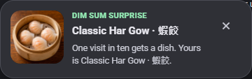

# Dim sum surprise

On ten percent of eligible repeat visits, one dim sum dish appears in a non-blocking card at the
bottom-left corner. The draw and rendering logic live in
[`ui-md3/site/dimsum.js`](../../../ui-md3/site/dimsum.js); the bounded metadata cache lives in
[`ui-md3/site/dimsum.data.js`](../../../ui-md3/site/dimsum.data.js).



## Catalog and photo source

Dish names, accessible descriptions, filenames and hashes come from the public
[`Ding-Ding-Projects/dim-sum-photos`](https://github.com/Ding-Ding-Projects/dim-sum-photos)
catalog. The authoritative index is
[`catalog/index.json`](https://raw.githubusercontent.com/Ding-Ding-Projects/dim-sum-photos/main/catalog/index.json).
The committed cache records source revision `f77ea1169db0bfc17365414c44ff495a823c6823` and contains
ten records, avoiding an eight-megabyte catalog download at startup.

Photos are not copied into this repository. Every cached URL targets an image published in the
catalog repository's `catalog-v1` release, and each record retains the catalog's SHA-256 for the
online correspondence check. GitHub currently reports that release as mutable, so the release tag
is not presented as an integrity boundary: the online contract revalidates the pinned catalog
revision, all ten release assets, and their published digests. The browser still treats the image
as optional presentation rather than downloading it into a privileged verifier. The card uses
`referrerPolicy = "no-referrer"`; code, styles and fonts remain same-origin, and the site carries no
analytics or tracker.

## Startup behavior

- One fresh `Math.random() < 0.10` draw is made per eligible launch. It is never re-rolled, so the
  card cannot appear twice in one launch or exceed the stated probability.
- The first visit is always excluded. If local storage is unavailable, the site cannot establish a
  prior visit honestly and skips the surprise.
- The image loads asynchronously without delaying startup. A missing or undecodable photo cancels
  the optional card, and a four-second deadline prevents a slow response from appearing after the
  visitor is already working.
- Pointer, keyboard, input, navigation and page-visibility activity during that pending load cancels
  it permanently for the launch. A photo that finishes afterward cannot interrupt the new task.
- The card never takes focus, never gates the page, can be dismissed immediately, and otherwise
  removes itself after twelve seconds. Hover and keyboard focus pause that countdown; manual
  dismissal returns focus to the active tab when the card owned focus.
- There is no opt-out control. Older profiles may contain a `dimSum` preference from an earlier
  release; initialization removes that key while preserving every unrelated setting.

## Language and accessibility

The dish's authoritative English and Traditional Chinese names are always shown together, with the
active language first. Name order, photo alt text and surrounding copy update live if the language
changes while the photo is loading or while the card is visible. Surrounding copy follows the
selected language mode and its corresponding funny level without changing the dish name or the
one-in-ten fact. The photo alt text identifies the dish in both languages, the card is a
`role="note"`, its dismiss control has a localized accessible name, and the entry animation is
removed under `prefers-reduced-motion`.

## Failure and security boundaries

The photo URL is static catalog metadata and must use HTTPS under the catalog repository's published
release path. No response body is treated as code, no HTML is generated from catalog text, and no
fallback image is downloaded, generated or stored in this consumer repository. Offline, blocked,
slow, missing and corrupt image responses all fail closed by showing no card; the rest of the site
continues normally.

## Verification

Run:

```powershell
node --test ui-md3/tests/site.test.mjs ui-md3/tests/site-behaviour.test.mjs
node --test ui-md3/tests/dim-sum-runtime.test.mjs
node --test ui-md3/tests/dim-sum-catalog-online.test.mjs
node --test ui-md3/tests/capture-manifest.test.mjs
node --check ui-md3/site/dimsum.data.js
node --check ui-md3/site/dimsum.js
node --check ui-md3/site/boot.js
```

The contracts assert the exact 10% probability, bilingual names and alt text, pinned release URL
shape, recorded SHA-256 values, removal of inline artwork and all opt-out surfaces, and migration of
the retired stored preference. The online contract compares all ten cached records with the pinned
catalog revision and the current published release assets, including their GitHub-reported digests;
its negative control proves that a valid-looking but altered digest is rejected. Deterministic
runtime contracts execute first-visit suppression, one-draw selection, activity and visibility
cancellation, load/error/decode/timeout races, live language changes, strict URL rejection, compact
toast stacking, and focus-safe dismissal. The Pages capture harness suppresses the startup draw only
inside its pre-document test environment, then invokes the production renderer once; it fails if the
published photo cannot decode. The capture manifest checks the tracked PNG's dimensions, digest and
harness provenance.

## Suggested articles

- [Notifications](notifications.md) — non-blocking message behavior and history.
- [Language modes and funny levels](language-and-funny-levels.md) — how bilingual copy and tone are
  selected without changing facts.
- [Deployment and the layout gate](deployment-and-layout-gate.md) — composition, offline checks and
  runtime layout coverage.
