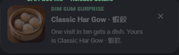

> 英文原文：[Dim sum surprise](dim-sum-surprise.md)

# 點心驚喜

喺合資格嘅重複訪問嘅十份之一，一個點心菜式會出現喺一個非阻斷卡片喺左下角。抽籤同渲染邏輯住喺 [`ui-md3/site/dimsum.js`](../../../ui-md3/site/dimsum.js)；有界中繼資料快取住喺 [`ui-md3/site/dimsum.data.js`](../../../ui-md3/site/dimsum.data.js)。



## 目錄同相片來源

菜式名稱、無障礙描述、檔案名稱同雜湊嚟自公開 [`Ding-Ding-Projects/dim-sum-photos`](https://github.com/Ding-Ding-Projects/dim-sum-photos) 目錄。權威索引係 [`catalog/index.json`](https://raw.githubusercontent.com/Ding-Ding-Projects/dim-sum-photos/main/catalog/index.json)。已提交快取記錄來源修訂 `f77ea1169db0bfc17365414c44ff495a823c6823` 同包含十筆記錄，避免一個八百萬位元組目錄喺啟動時嘅下載。

相片唔係複製到呢倉庫。每個快取 URL 目標一個相片發佈喺目錄倉庫嘅 `catalog-v1` 發行版，同每筆記錄保留目錄嘅 SHA-256 用於線上對應檢查。GitHub 目前報告呢發行版係可變，所以發行版標籤唔係表現為完整性邊界：線上合同重新驗證釘住目錄修訂、所有十個發行資產同佢哋嘅發佈摘要。瀏覽器仍然視影像為選擇呈現代替將佢下載到一個特權驗證器。卡片使用 `referrerPolicy = "no-referrer"`；程式碼、樣式同字型保持同源，同網站唔帶著分析或追蹤器。

## 啟動行為

- 一個新鮮 `Math.random() < 0.10` 抽籤係為每合資格啟動做。佢永遠唔會被重新滾，所以卡片無法喺一次啟動中出現兩次或超越陳述機率。
- 第一次訪問總係被排除。如果本地儲存空間唔可用，網站無法建立一個先前訪問誠實同跳過驚喜。
- 影像非同步載入冇延遲啟動。一個缺失或無法解碼相片會取消選擇卡片，同一個四秒截止日期防止緩慢回應喺訪客已工作時出現。
- 指標、鍵盤、輸入、導航同頁面可見性活動喺該挾制載入期間取消佢永久用於啟動。一個之後完成相片無法中斷新任務。
- 卡片永遠唔採用焦點、永遠唔大門頁面、可以立即被關閉，同否則喺十二秒後移除自己。懸停同鍵盤焦點暫停呢計數；手動關閉返回焦點到活動標籤當卡片擁有焦點時。
- 冇選擇退出控制。舊配置檔案可能含有一個 `dimSum` 偏好從一個較早發行版；初始化移除呢個鍵同時保留每個無關設定。

## 語言同無障礙

菜式嘅權威英文同繁體中文名稱總係展示在一起，帶著活動語言優先。名稱順序、相片替代文字同周圍複製如果語言改變當相片係載入或當卡片係可見時實時更新。周圍複製跟隨選擇語言模式同其對應滑稽等級冇改變菜式名稱或十分之一事實。相片替代文字用兩種語言識別菜式，卡片係 `role="note"`，其關閉控制有一個本地化無障礙名稱，同條目動畫喺 `prefers-reduced-motion` 下移除。

## 失敗同安全邊界

相片 URL 係靜態目錄中繼資料同必須喺目錄倉庫嘅發佈發行版路徑下使用 HTTPS。冇回應主體被對待為程式碼，冇 HTML 係由目錄文字產生，同冇退回影像係下載、產生或儲存喺呢消費倉庫。離線、阻止、緩慢、缺失同腐敗影像回應全部失敗關閉由不展示卡片；網站嘅休息繼續正常。

## 驗證

執行：

```powershell
node --test ui-md3/tests/site.test.mjs ui-md3/tests/site-behaviour.test.mjs
node --test ui-md3/tests/dim-sum-runtime.test.mjs
node --test ui-md3/tests/dim-sum-catalog-online.test.mjs
node --test ui-md3/tests/capture-manifest.test.mjs
node --check ui-md3/site/dimsum.data.js
node --check ui-md3/site/dimsum.js
node --check ui-md3/site/boot.js
```

合同判斷精確 10% 機率、雙語名稱同替代文字、釘住發行版 URL 形狀、記錄 SHA-256 值、內聯藝術品同所有退出表面嘅移除，同退休已儲存偏好嘅遷移。線上合同比較所有十個快取記錄帶著釘住目錄修訂同目前發佈發行資產，包括佢哋嘅 GitHub 報告摘要；佢嘅負面控制證明一個有效外觀但改變摘要係被拒。決定性執行時合同執行優先訪問抑制、一個抽籤選擇、活動同可見性取消、載入/錯誤/解碼/逾時競賽、實時語言改變、嚴格 URL 拒絕、緊湊粉撲堆疊同焦點安全關閉。頁面捕獲線束喺其預文件測試環境內只抑制啟動抽籤，然後呼叫生產渲染器一次；如果發佈相片無法解碼佢失敗。捕獲清單檢查追蹤 PNG 嘅尺寸、摘要同線束起源。

## 建議文章

- [通知](notifications.md) ： 非阻斷訊息行為同歷史。
- [語言模式同滑稽等級](language-and-funny-levels.md) ： 雙語複製同語調係點樣被選擇冇改變事實。
- [部署同佈局大門](deployment-and-layout-gate.md) ： 作曲、離線檢查同執行時佈局覆蓋。
